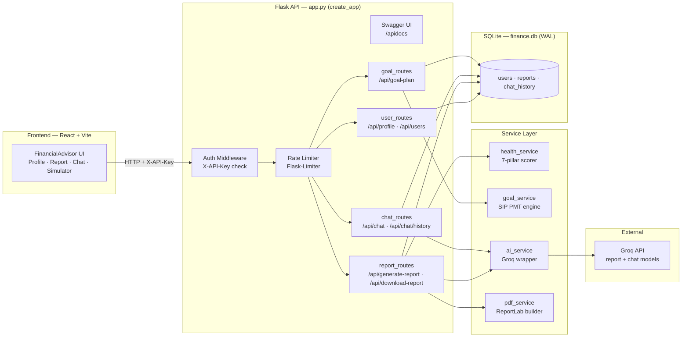
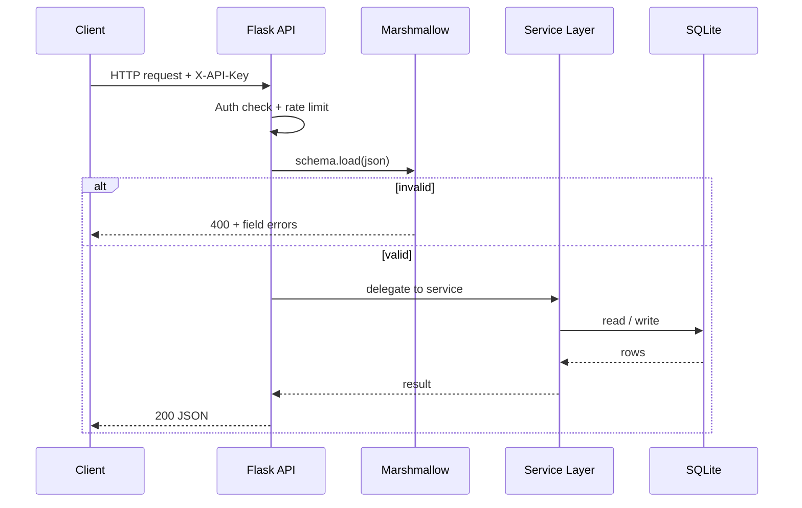

<div align="center">

# FinPilot AI

### AI-Powered Personal Financial Advisor

A production-oriented **Flask + React** application that pairs deterministic financial-scoring
engines with an LLM advisory layer (**Groq**) to deliver personalised financial
health assessments, AI-generated advisory reports, conversational guidance, and
goal-feasibility simulations for Indian retail investors.

<br/>


</div>

---

## Table of Contents

- [Overview](#overview)
- [Key Features](#key-features)
- [Architecture](#architecture)
- [Request Lifecycle](#request-lifecycle)
- [Tech Stack](#tech-stack)
- [Project Structure](#project-structure)
- [Getting Started](#getting-started)
- [API Reference](#api-reference)
- [Financial Health Scoring Model](#financial-health-scoring-model)
- [Goal Feasibility Simulator](#goal-feasibility-simulator)
- [Database Schema](#database-schema)
- [Roadmap](#roadmap)
- [Disclaimer](#disclaimer)
- [Author](#author)

---

## Overview

FinPilot AI ingests a user's financial profile — age, income, expenses, savings, risk
appetite, goals, and an optional EMI figure — and layers three independent engines on top of it:

1. **Deterministic financial-health scorer** — a 7-pillar, rule-based engine that produces a
   0–100 score with no AI involvement, so results are reproducible and explainable.
2. **LLM advisory layer** — turns the scored profile into a structured, SEBI-advisor-style
   report and a conversational chat assistant, grounded in the user's actual numbers. Powered
   by **Groq** with per-service model routing (a high-capability model for the in-depth report,
   a low-latency model for live chat).
3. **Goal-feasibility simulator** — SIP (Systematic Investment Plan) annuity-due mathematics
   that projects Conservative / Balanced / Aggressive investment scenarios.

Reports are rendered to branded PDF documents, persisted to SQLite, and served through a
fully documented, rate-limited, API-key-protected REST API with an interactive Swagger UI.

---

## Key Features

- **Financial Health Score** — 7-pillar rule-based engine (savings rate, expense control,
  emergency fund, debt-to-income, retirement adequacy, tax efficiency, surplus buffer).
- **AI-Generated Advisory Reports** — structured, section-based reports grounded in the
  user's real figures, produced via Groq (`openai/gpt-oss-120b` by default).
- **Conversational Advisor Chat** — per-user chat with persistent history stored in SQLite.
- **Goal Feasibility Simulator** — SIP PMT–based required-contribution calculator with three
  CAGR scenarios, feasibility scoring, and a recommended timeline.
- **PDF Report Generation** — branded, multi-section advisory PDFs via ReportLab (cover page,
  snapshot, insights, warnings, AI recommendations, action checklist, disclaimer).
- **Persistent Storage** — SQLite with WAL journaling, foreign-key enforcement, and indexed
  lookups for users, reports, and chat history.
- **API Security** — global `X-API-Key` enforcement on all `/api/*` routes.
- **Rate Limiting** — global and per-route limits via Flask-Limiter.
- **Swagger / OpenAPI Docs** — interactive documentation at `/apidocs/`.
- **Strict Request Validation** — Marshmallow schemas on every mutating endpoint.
- **React + Vite Frontend** — a polished single-page client (`frontend/`) that consumes the API.

---

## Architecture



**Layer summary**

1. Every `/api/*` request (except `OPTIONS` and doc routes) passes the `X-API-Key` check and
   the rate limiter before reaching a blueprint.
2. Route handlers validate incoming JSON against Marshmallow schemas, then delegate to the
   service layer.
3. `health_service` computes a deterministic 0–100 score, `goal_service` runs SIP
   projections, `ai_service` calls Groq, and `pdf_service` renders the final PDF.
4. All persistent state lives in SQLite, accessed through a shared WAL-mode connection helper.

> A deeper engineering write-up — including the data model, per-service diagrams, and a full
> production-readiness assessment — lives in [`docs/ARCHITECTURE.md`](docs/ARCHITECTURE.md).

---

## Request Lifecycle



---

## Tech Stack

| Layer | Technology |
|---|---|
| Backend framework | Flask, Flask-CORS, Flask-Limiter |
| API documentation | Flasgger (Swagger UI) |
| Validation | Marshmallow |
| Database | SQLite (WAL mode, foreign keys enforced) |
| AI / LLM | Groq (`openai/gpt-oss-120b` report · `openai/gpt-oss-20b` chat) |
| PDF generation | ReportLab |
| Frontend | React 19, Vite, ESLint |
| Config | python-dotenv |

---

## Project Structure

```
FinPilot/
├── app.py                     # App factory: CORS, auth middleware, rate limiter, Swagger, blueprints
├── config.py                  # Environment variable loading and validation
├── extensions.py              # Shared Flask-Limiter instance
├── schemas.py                 # Marshmallow request schemas (Profile, Report, Chat, GoalPlan)
├── requirements.txt           # Python dependencies
├── database/
│   ├── db.py                  # SQLite connection helper (WAL, foreign keys)
│   └── models.py              # Table creation (users, reports, chat_history) + indexes
├── models/
│   └── user_model.py          # UserProfile data class
├── routes/
│   ├── user_routes.py         # Profile CRUD (/api/profile, /api/users)
│   ├── report_routes.py       # Report generation, retrieval, PDF download
│   ├── chat_routes.py         # Chat + chat-history retrieval/deletion
│   └── goal_routes.py         # Goal feasibility simulation endpoint
├── services/
│   ├── health_service.py      # 7-pillar financial-health scoring engine
│   ├── goal_service.py        # SIP PMT math, scenario simulation, feasibility scoring
│   ├── ai_service.py          # Groq client wrapper, report + chat generation
│   ├── pdf_service.py         # ReportLab PDF report builder
│   └── profiling_service.py   # Standalone profile validation/normalization helpers
├── utils/
│   └── prompt_builder.py      # Deterministic, grounded prompt construction for the LLM
├── frontend/
│   ├── src/
│   │   ├── FinancialAdvisor.jsx  # Main UI (profile, report, chat, simulator)
│   │   ├── App.jsx               # Root component
│   │   ├── main.jsx              # React entry point
│   │   └── index.css             # Styling
│   ├── package.json
│   ├── vite.config.js
│   └── eslint.config.js
├── tests/                     # Offline unit tests (config + ai_service, Groq mocked)
│   ├── test_config.py
│   └── test_ai_service.py
├── conftest.py                # Pytest bootstrap (sys.path + deterministic test env)
└── docs/
    └── ARCHITECTURE.md        # Detailed architecture & production-readiness reference
```

---

## Getting Started

### Prerequisites

- Python 3.10+
- A Groq API key
- Node.js 18+ (for the frontend)

### 1. Clone the repository

```bash
git clone https://github.com/ShantanuGarg2004/FinPilot.git
cd FinPilot
```

### 2. Backend setup

```bash
# (recommended) create and activate a virtual environment
python -m venv .venv
# Windows
.venv\Scripts\activate
# macOS / Linux
source .venv/bin/activate

pip install -r requirements.txt
```

Create a `.env` file in the project root:

```env
GROQ_API_KEY=your-groq-api-key
API_SECRET_KEY=your-chosen-api-secret
RATELIMIT_STORAGE_URI=memory://

# Optional — per-service model overrides (defaults shown)
GROQ_REPORT_MODEL=openai/gpt-oss-120b
GROQ_CHAT_MODEL=openai/gpt-oss-20b
```

> `GROQ_API_KEY` and `API_SECRET_KEY` are **required** — the server refuses to start
> without them. `RATELIMIT_STORAGE_URI` defaults to `memory://` (use a Redis URI in production).
> The model variables are optional and fall back to the defaults shown above.

Run the server:

```bash
python app.py
```

- API base: `http://127.0.0.1:5000`
- Interactive docs: `http://127.0.0.1:5000/apidocs/`

Every `/api/*` request must include the header:

```
X-API-Key: your-chosen-api-secret
```

### 3. Frontend setup

```bash
cd frontend
npm install
npm run dev
```

The dev server runs on Vite's default port (`http://localhost:5173`). It expects the API at
`http://localhost:5000/api`; configure it via a `frontend/.env` file:

```env
VITE_API_URL=http://127.0.0.1:5000/api
VITE_API_KEY=your-chosen-api-secret
```

### 4. Running tests

The backend ships with an offline unit-test suite (Groq API calls are mocked, so no key or
network is required):

```bash
pip install pytest
python -m pytest tests/ -v
```

---

## API Reference

All endpoints (except `/`, `/apidocs/`, and `/apispec.json`) require an `X-API-Key` header
matching `API_SECRET_KEY`.

| Endpoint | Method | Rate limit | Description |
|---|---|---|---|
| `/` | GET | — | Health check / service banner |
| `/apidocs/` | GET | — | Swagger UI |
| `/api/users` | GET | default | List all saved user profiles |
| `/api/profile` | POST | default | Create a new user profile |
| `/api/profile/<user_id>` | DELETE | default | Delete a profile + associated report/chat |
| `/api/generate-report` | POST | 5/min | Generate (or regenerate) an AI report + PDF |
| `/api/report/<user_id>` | GET | default | Fetch a previously generated report |
| `/api/download-report/<user_id>` | GET | default | Download the stored PDF report |
| `/api/chat` | POST | 15/min | Send a message to the AI advisor |
| `/api/chat/history/<user_id>` | GET | default | Fetch stored chat history |
| `/api/chat/history/<user_id>` | DELETE | default | Clear chat history for a user |
| `/api/goal-plan` | POST | 20/min | Run the goal feasibility simulation |

Default rate limits (unless overridden per route): **200 requests/day, 60 requests/hour**, per client IP.

<details>
<summary>Example: create a profile</summary>

```bash
curl -X POST http://127.0.0.1:5000/api/profile \
  -H "Content-Type: application/json" \
  -H "X-API-Key: your-chosen-api-secret" \
  -d '{
    "age": 28,
    "income": 90000,
    "expenses": 50000,
    "savings": 25000,
    "risk_appetite": "medium",
    "financial_goals": "Buy a house in 7 years",
    "debt_emi": 8000
  }'
```
</details>

---

## Financial Health Scoring Model

The health score is computed across seven weighted pillars, totalling 100 points:

| Pillar | Max points | Full-marks threshold |
|---|---|---|
| Savings rate | 25 | 30% of income or higher |
| Expense control | 20 | Expenses ≤ 50% of income |
| Emergency fund | 20 | 6+ months of expenses covered |
| Debt-to-income ratio | 15 | ≤ 20% DTI (partial credit if EMI not provided) |
| Retirement adequacy | 10 | Age-adjusted corpus projection vs. a 25× annual-expense target |
| Tax efficiency | 5 | Estimated Section 80C utilisation |
| Surplus buffer | 5 | Any positive monthly surplus |

Each pillar independently returns point contributions, human-readable insights, and warnings,
which are aggregated into the final score and passed to the AI report generator for grounded advice.

---

## Goal Feasibility Simulator

The simulator uses the standard SIP PMT (annuity-due) formula to compute the monthly
contribution required to reach a target amount within a given horizon:

```
P = FV × r / [ ((1 + r)^n − 1) × (1 + r) ]
```

Where `P` is the required monthly SIP, `FV` is the target amount, `r` is the monthly rate, and
`n` is the number of months. The engine:

- Selects instrument recommendations and CAGR assumptions from risk appetite and horizon
  (Low / Medium / High tiers).
- Produces Conservative, Balanced, and Aggressive scenario projections.
- Computes a rule-based feasibility score (0–100) from savings coverage, horizon bonus, and
  risk-alignment bonus.
- Binary-searches the achievable timeline at the current savings rate.

---

## Database Schema

| Table | Purpose | Key constraints |
|---|---|---|
| `users` | Stores financial profiles | Auto-incrementing primary key `id` |
| `reports` | Stores generated reports + PDF blobs | `user_id` unique, FK to `users`, cascade delete |
| `chat_history` | Stores per-user chat messages | FK to `users`, cascade delete, `role ∈ {user, ai}` |

Indexes are created on `reports(user_id)` and the composite `chat_history(user_id, id DESC)`
to optimise the most frequent lookup and pagination patterns.

---

## Roadmap

- Serve behind a production WSGI server (gunicorn/waitress) with `debug=False`.
- Replace the shared API key with per-user authentication and authorisation.
- Migrate storage from SQLite to PostgreSQL and move rate-limit state to Redis for
  multi-instance deployments.
- Extend automated test coverage to the deterministic scoring and simulation engines
  (config and AI-service layers are already unit-tested — see [`tests/`](tests/)).
- Support live market data for CAGR assumptions instead of static tiers.

---

## Disclaimer

This system provides AI-assisted **educational** financial guidance and does **not** constitute
regulated investment advice. Independent professional consultation is recommended before making
investment decisions.

---

## Author

**Shantanu Garg**
B.Tech CSE-AI, Graphic Era (Deemed to be University), Dehradun
