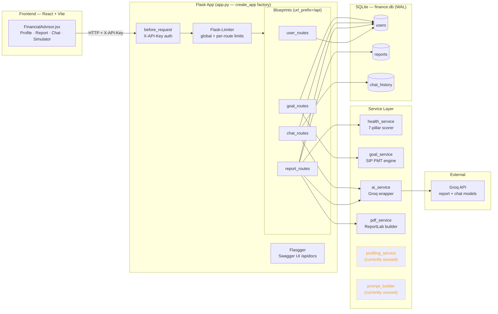
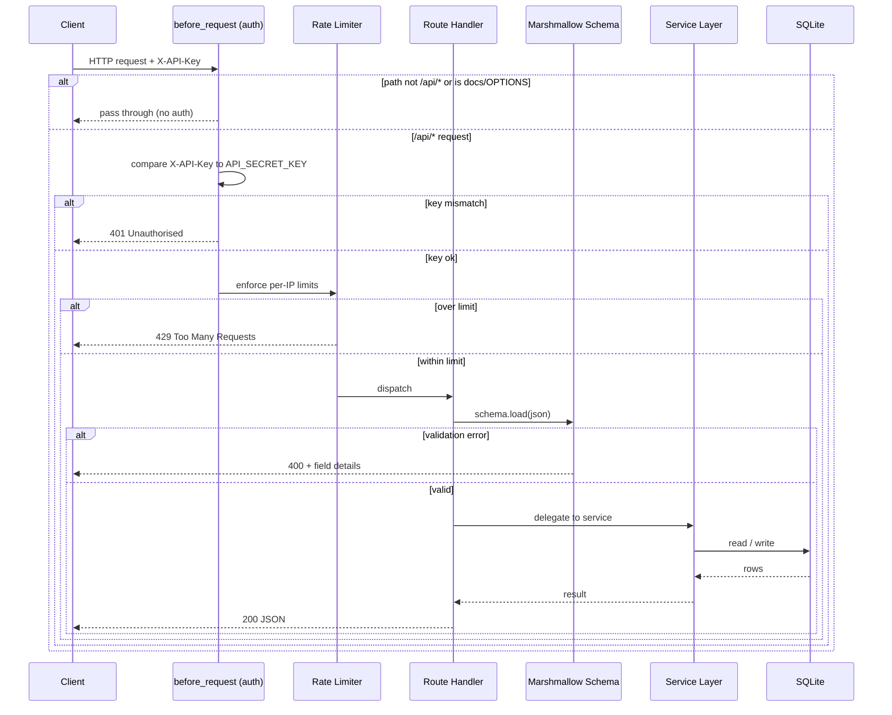
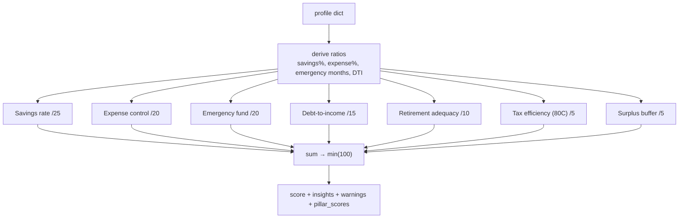
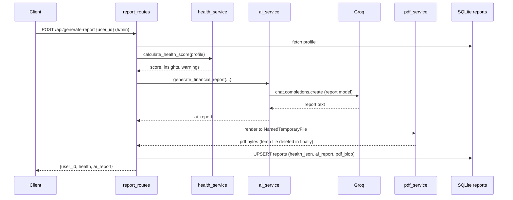
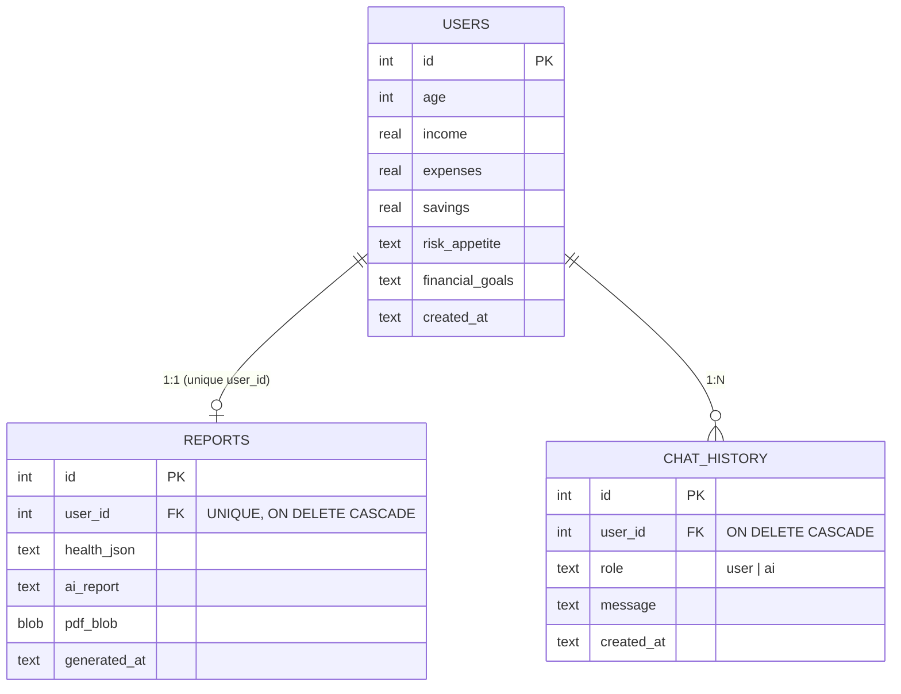
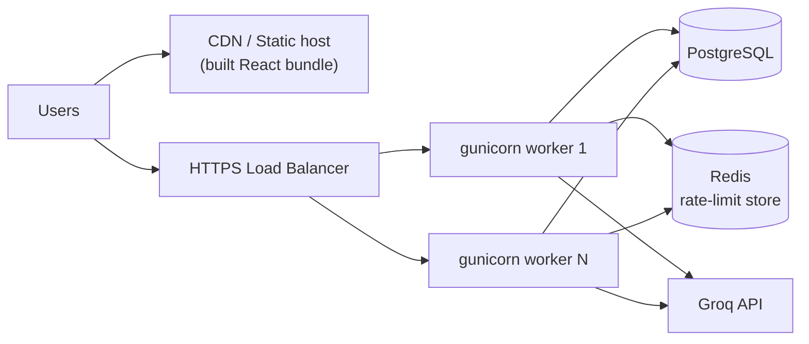

# FinPilot AI — Architecture, Services & Production Readiness

> Internal engineering reference. This document describes the **as-built** state of the
> codebase (not the aspirational design), the services it offers, and an honest
> assessment of what stands between the current build and a production deployment.

- **Project:** FinPilot AI — AI-Powered Personal Financial Advisor
- **Backend:** Python 3.10+ / Flask (app-factory pattern)
- **Frontend:** React 19 + Vite (single-page client)
- **Persistence:** SQLite (WAL journal mode)
- **External dependency:** Groq Chat Completions API (via the official `groq` SDK) — per-service
  models: `openai/gpt-oss-120b` (report) and `llama-3.1-8b-instant` (chat)

---

## 1. System Overview

FinPilot AI ingests a user's financial profile (age, income, expenses, savings, risk
appetite, goals, optional EMI) and layers three independent engines on top of it:

1. A **deterministic financial-health scorer** — 7 weighted pillars, 0–100 scale, no AI.
2. An **LLM advisory layer** — turns the scored profile into a structured advisory report
   and a conversational chat assistant via Groq.
3. A **goal-feasibility simulator** — SIP (annuity-due) mathematics projecting
   Conservative / Balanced / Aggressive scenarios, entirely rule-based.

Reports are rendered to branded PDFs, persisted to SQLite, and served through a
rate-limited, API-key-protected REST API with auto-generated Swagger docs.

---

## 2. High-Level Architecture



> **Note (accuracy):** `ai_service.py` builds its prompts inline. It does **not** import
> `utils/prompt_builder.py`, and no route imports `services/profiling_service.py`.
> Both modules are dead code today (shown dashed above).

---

## 3. Request Lifecycle

Every `/api/*` call flows through the same guard rails before reaching business logic.



---

## 4. Services Offered

### 4.1 User Profiles — `routes/user_routes.py`

| Endpoint | Method | Rate limit | Purpose |
|---|---|---|---|
| `/api/users` | GET | default | List all saved profiles |
| `/api/profile` | POST | default | Create a profile |
| `/api/profile/<user_id>` | DELETE | default | Delete profile + cascade report/chat |

Profiles are validated by `ProfileSchema` (age 1–120, non-negative money fields, risk in
`{low, medium, high}`, goals 3–500 chars, optional `debt_emi`). The DELETE path manually
removes rows from `reports`, `chat_history`, then `users` inside one transaction.

### 4.2 Financial Health Scorer — `services/health_service.py`

Pure-Python deterministic engine, no external calls. Returns a 0–100 score plus
per-pillar breakdown, insights, warnings, and UI bar percentages.



| Pillar | Max | Full-marks threshold |
|---|---|---|
| Savings rate | 25 | ≥ 30% of income |
| Expense control | 20 | ≤ 50% of income |
| Emergency fund | 20 | ≥ 6 months of expenses |
| Debt-to-income | 15 | ≤ 20% DTI (partial credit if EMI not supplied) |
| Retirement adequacy | 10 | FV of savings @10% CAGR ≥ 80% of 25× annual expenses |
| Tax efficiency | 5 | Estimated 80C utilisation (heuristic: 30% of savings) |
| Surplus buffer | 5 | Any positive monthly surplus |

### 4.3 AI Advisory Layer — `services/ai_service.py`

Wraps the **Groq** client (official `groq` SDK, temperature 0.7, max 1000 tokens) with
**per-service model routing**. The shared `ask_gpt(prompt, model=None)` helper defaults to
`Config.GROQ_CHAT_MODEL` and logs failures via `logger.exception`. Two entry points:

- `generate_financial_report(profile, health_data)` → structured 6-section markdown report,
  using `Config.GROQ_REPORT_MODEL` (default `openai/gpt-oss-120b`) for depth/quality.
- `chat_with_advisor(profile, query, history)` → conversational response, using
  `Config.GROQ_CHAT_MODEL` (default `llama-3.1-8b-instant`) for low latency.

All calls return a `(success: bool, payload: str)` tuple; exceptions are caught, logged, and
surfaced as the error string rather than raised. Models are configurable via `.env`
(`GROQ_REPORT_MODEL` / `GROQ_CHAT_MODEL`).

### 4.4 Report + PDF — `routes/report_routes.py` + `services/pdf_service.py`



The PDF is generated to a secure temp file, read into memory, stored as a BLOB, and the
temp file is deleted in a `finally` block. Download is served from the DB BLOB via
`/api/download-report/<user_id>`.

### 4.5 Conversational Chat — `routes/chat_routes.py`

| Endpoint | Method | Rate limit | Purpose |
|---|---|---|---|
| `/api/chat` | POST | 15/min | Ask the advisor |
| `/api/chat/history/<user_id>` | GET | default | Fetch history (last 100) |
| `/api/chat/history/<user_id>` | DELETE | default | Clear history |

The last 20 messages are loaded for context; user and AI turns are persisted to
`chat_history`.

> **Known bug:** `chat_with_advisor` iterates history with `msg.get("content")`, but the
> route supplies messages keyed as `message`. The conversation-context block is therefore
> **always empty** and chat is effectively stateless despite the history round-trip.

### 4.6 Goal Feasibility Simulator — `services/goal_service.py`

Rule-based SIP engine using the annuity-due PMT formula:

```
P = FV × r / [ ((1 + r)^n − 1) × (1 + r) ]
```

- Picks a CAGR tier (5–7% / 8–12% / 10–15%) from risk appetite and horizon.
- Computes required monthly SIP for Conservative / Balanced / Aggressive scenarios.
- Produces a 0–100 feasibility score (savings coverage 70 + horizon bonus 20 + risk
  alignment 10) and a gap analysis.
- Binary-searches the achievable timeline at the current savings rate.

---

## 5. Data Model



Connections open with `PRAGMA journal_mode=WAL`, `foreign_keys=ON`,
`synchronous=NORMAL`. Indexes exist on `reports(user_id)` and
`chat_history(user_id, id DESC)`.

---

## 6. Production-Readiness Assessment

Overall the codebase is **a strong, well-structured prototype / MVP**. It is **not yet
production-ready** for a public multi-user deployment. Assessment by dimension:

| Dimension | Status | Notes |
|---|:---:|---|
| Code structure | 🟢 Good | Clean app-factory, blueprints, service separation, schema validation |
| Input validation | 🟢 Good | Marshmallow on every mutating route with field-level errors |
| Error handling | 🟢 Good | Broad try/except, structured logging, safe temp-file cleanup |
| API security | 🟡 Partial | Single shared `X-API-Key`; no per-user identity/authz |
| CORS | 🟡 Partial | `origins: "*"` on `/api/*` — tighten for production |
| Rate limiting | 🟡 Partial | In-memory store by default; not shared across instances |
| Persistence | 🟡 Partial | SQLite is single-writer; won't scale horizontally |
| Secrets | 🟢 Good | Loaded from `.env`, validated at startup, not hard-coded |
| Runtime | 🔴 Gap | `app.run(debug=True)` — dev server + debugger, unsafe in prod |
| Dead code | 🔴 Gap | `prompt_builder.py` & `profiling_service.py` unused |
| Correctness bug | 🔴 Gap | Chat history context never populated (`content` vs `message`) |
| Tests | 🟡 Partial | Offline unit tests for `config` + `ai_service` (17 tests, Groq mocked); scoring/simulation engines still uncovered |
| Containerisation/CI | 🔴 Gap | No Dockerfile, no CI pipeline |
| Observability | 🟡 Partial | Logging present; no metrics/tracing/health-with-DB probe |
| Branding | 🟡 Minor | Frontend header reads "FinanceAI"; project is "FinPilot" |
| Repo hygiene | 🟡 Minor | `finance.db` and generated PDFs were committed (now git-ignored) |

### 6.1 Must-fix before production

1. **Replace the dev server.** Serve via a WSGI server (e.g. `gunicorn`/`waitress`) and set
   `debug=False`. The Werkzeug debugger allows arbitrary code execution if exposed.
2. **Fix the chat-context bug.** Align the history key (`message`) between
   `chat_routes` and `ai_service.chat_with_advisor`, or route chat through
   `utils/prompt_builder.build_chat_prompt` (which already reads `message`).
3. **Harden auth.** A single shared API key gives every client access to every profile.
   Introduce per-user authentication/authorisation before storing real user data.
4. **Externalise rate-limit + move off SQLite** for multi-instance deployments
   (Redis for Flask-Limiter, PostgreSQL for data).
5. **Lock down CORS** to known frontend origins.

### 6.2 Should-fix / hygiene

- Remove or wire up the dead `prompt_builder.py` and `profiling_service.py` (the prompt
  builder is notably higher-quality than the inline prompts currently used).
- Add a test suite for the deterministic engines (`health_service`, `goal_service`) — they
  are pure functions and trivially testable.
- Add a Dockerfile + CI (lint, test) pipeline.
- Add an authenticated `/health` probe that also verifies DB connectivity.
- Reconcile frontend branding ("FinanceAI" → "FinPilot").
- Pin dependency versions in `requirements.txt` (currently unpinned).

### 6.3 Production topology (target)



---

## 7. Summary

FinPilot AI is a cleanly layered Flask + React application with three genuinely useful,
well-implemented engines (health scoring, AI advisory, goal simulation) and solid
request-validation and error-handling discipline. The remaining gap to production is
primarily **operational** (real WSGI runtime, per-user auth, scalable datastore, tests, CI)
plus a **small set of correctness/cleanup fixes** (chat-context bug, dead modules,
branding). None of these are architecturally deep — the foundation is sound.
