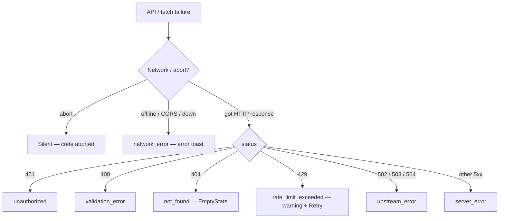
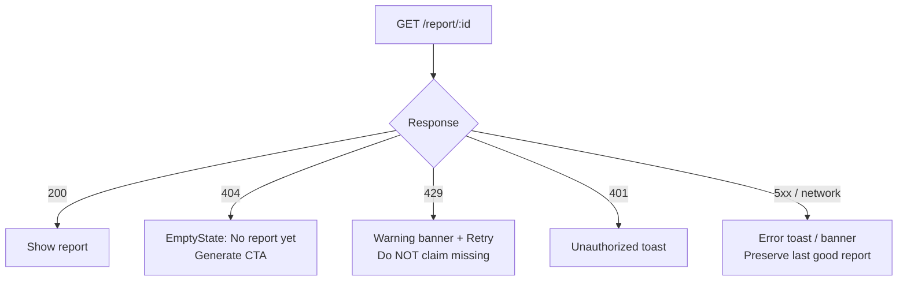

# FinPilot Frontend Error Handling

**Status:** Specification + implementation checklist  
**Companion docs:** `RATE_LIMITER_ARCHITECTURE.md`, `PLATFORM_ARCHITECTURE_BOTTLENECKS.md`  
**UI surface:** Toasts + inline empty/error states (no silent failures)

---

## 1. Problem statement

The SPA currently collapses almost every failure into a generic toast or, worse, treats **HTTP 429** on `GET /report/<id>` as **“No report yet”**. That drives a regenerate loop and hides auth, network, and upstream faults.

Goals:

1. Classify every API failure by **HTTP status + machine `code`**.  
2. Show **accurate, actionable** copy.  
3. Never imply missing data when the server throttled or errored.  
4. Support retries where safe (`429`, transient `503`/`502`).  
5. Keep success paths quiet (toast only when useful).

---

## 2. Error taxonomy



| Class | HTTP | Typical `code` | User meaning | UI treatment |
|---|---|---|---|---|
| **Network** | — | `network_error` | Offline / CORS / server down | Error toast; keep last good data |
| **Unauthorized** | 401 | `unauthorized` | Bad/missing API key | Error toast; block further mutating actions |
| **Validation** | 400 | `validation_error` | Bad form/body | Error toast with field details |
| **Not found** | 404 | `not_found` | No report / no profile | **Empty state** (not scary error) for reports; toast optional once |
| **Rate limited** | 429 | `rate_limit_exceeded` | Too many requests | **Warning** toast + `Retry-After`; do **not** clear data / do not say “no report” |
| **Upstream AI** | 502/503/504 or 500 with code | `upstream_error` / `upstream_rate_limit` | Groq/provider issue | Error toast; suggest retry later |
| **Server** | 500 | `server_error` | Unexpected backend bug | Error toast; no regenerate spam |
| **Abort / cancel** | — | `aborted` | Navigation unmount | Silent |

---

## 2.1 Report load decision (critical)



---

## 3. Endpoint × error matrix

### 3.1 Profiles — `GET /users`, `POST /profile`, `DELETE /profile/<id>`

| Situation | Status | Frontend behavior |
|---|---|---|
| List load fails (network) | — | Toast: “Can’t reach the server. Check that the API is running.” |
| List load 401 | 401 | Toast: “API key rejected. Check `VITE_API_KEY`.” |
| List load 429 | 429 | Warning: “Too many profile requests. Retrying in {n}s…” |
| Create validation | 400 | Toast with Marshmallow field messages |
| Create success | 200 | Success toast; navigate dashboard |
| Delete 404 | 404 | Toast: “Profile already removed.”; refresh list |
| Delete 429 | 429 | Warning; do not remove from local list until success |

### 3.2 Reports — `GET /report/<id>`, `POST /generate-report`, `GET /download-report/<id>`

| Situation | Status | Frontend behavior |
|---|---|---|
| GET 200 | 200 | Show report; clear prior error |
| GET 404 | 404 | Empty state: “No report yet” + Generate CTA (**info**, not error spam) |
| GET 429 | 429 | **Keep** `report` if already in memory; warning toast with retry; set `loadError = rate_limit`; **do not** show EmptyState as missing |
| GET 401 | 401 | Auth error toast |
| GET 500 | 500 | Error toast: “Couldn’t load saved report.” |
| GET network | — | Error toast; preserve last report |
| POST generate 200 | 200 | Success toast; set report |
| POST 429 | 429 | Warning: “Report generation limit reached. Try again in {n}s.” |
| POST 500 (PDF/AI) | 500 | Error with server `error` string |
| Download 404 | 404 | “Generate a report before downloading.” |
| Download 429 | 429 | Warning with retry |

**Critical rule:** `!res.ok` must **not** default to “No report yet”. Only **404** means missing.

### 3.3 Chat — `GET /chat/history/<id>`, `POST /chat`, `DELETE …`

| Situation | Status | Frontend behavior |
|---|---|---|
| History 200 | 200 | Render messages |
| History 429 | 429 | Warning; keep empty or stale history; offer retry |
| History network | — | Error toast |
| Send 200 | 200 | Append AI message |
| Send 429 | 429 | Warning; remove optimistic dead-end or mark failed; allow resend |
| Send 500 / upstream | 500 | Inline AI bubble: “Advisor unavailable…” + toast |
| Clear 429 | 429 | Warning; do not clear local until OK |

### 3.4 Goals — `POST /goal-plan`

| Situation | Status | Frontend behavior |
|---|---|---|
| Client validation | — | Toast before request |
| 400 | 400 | Field / schema toast |
| 429 | 429 | Warning + retry after |
| 500 | 500 | Error toast |
| 200 | 200 | Show scenarios (no toast required) |

---

## 4. Shared client contract

### 4.1 `ApiError` shape (frontend)

```js
{
  name: "ApiError",
  message: string,      // human-readable
  status: number | 0,   // 0 = network
  code: string,         // machine code
  details: any,         // marshmallow details, etc.
  retryAfter: number | null  // seconds
}
```

### 4.2 Mapping rules (`apiFetch`)

1. Network / failed `fetch` → `status: 0`, `code: "network_error"`.  
2. JSON body `error` / `code` / `retry_after` preferred when present.  
3. Status fallbacks: `401→unauthorized`, `404→not_found`, `429→rate_limit_exceeded`, `5xx→server_error`.  
4. Parse `Retry-After` header when body lacks `retry_after`.

### 4.3 Toast types

| Type | Use |
|---|---|
| `success` | Create profile, generate report, clear chat |
| `error` | Auth, validation, server, network, upstream |
| `warning` | Rate limits, soft degradations |
| `info` | Optional: first-time “no report yet” (prefer EmptyState) |

---

## 5. Hook-level state flags (recommended)

Beyond toasts, hooks expose:

| Hook | Extra state | Purpose |
|---|---|---|
| `useReport` | `loadError`, `fetching`, `generating` | Advisory/Dashboard choose EmptyState vs error banner |
| `useChat` | `loadError`, `sending` | History retry affordance |
| `useProfiles` | `loadError` | Profile rail error |
| `useGoalPlan` | (toast only) | Ephemeral action |

`loadError.code === "rate_limit_exceeded"` → banner: “Temporarily throttled — your saved report may still be on the server. Retry.”

---

## 6. Copy catalog (canonical)

| Code | Default message |
|---|---|
| `network_error` | Can’t reach the FinPilot API. Confirm the backend is running on port 5000. |
| `unauthorized` | Unauthorized — check your API key configuration. |
| `validation_error` | (server details) or “Please check the highlighted fields.” |
| `not_found` (report) | No saved report for this profile yet. |
| `not_found` (download) | No PDF available — generate a report first. |
| `rate_limit_exceeded` | Too many requests. Try again in {retryAfter}s. |
| `upstream_error` | The AI provider is unavailable. Please try again shortly. |
| `upstream_rate_limit` | AI provider rate limit hit. Please wait and retry. |
| `server_error` | Something went wrong on the server. Please try again. |
| `aborted` | (silent) |

---

## 7. Implementation inventory (this change set)

| File | Change |
|---|---|
| `frontend/src/components/LoadErrorBanner.jsx` | **New** — inline throttle/auth/network banner with Retry |
| `frontend/src/lib/apiErrors.js` | **New** — `ApiError`, `toApiError`, `formatApiErrorMessage` |
| `frontend/src/config/api.js` | Throw `ApiError`; parse status / Retry-After; `apiFetchRaw` for blobs |
| `frontend/src/components/Toast.jsx` | Support `warning` + `info` styles; longer TTL for warnings |
| `frontend/src/hooks/useReport.js` | Branch 404 / 429 / other; expose `loadError` + `retryLoad` |
| `frontend/src/hooks/useChat.js` | Classify load/send/clear errors; expose `loadError` + `retryLoad` |
| `frontend/src/hooks/useProfiles.js` | Classify list errors; expose `loadError` |
| `frontend/src/hooks/useGoalPlan.js` | Use formatted ApiError messages |
| `frontend/src/pages/AdvisoryPage.jsx` | EmptyState only on true 404; blocked-load state for 429/5xx |
| `frontend/src/pages/DashboardPage.jsx` | Same loadError awareness for health panel |
| `frontend/src/pages/ChatPage.jsx` | LoadErrorBanner + retry for history |
| `frontend/src/sections/profile/ProfileForm.jsx` | Status-aware create errors |
| `frontend/src/sections/profile/SavedProfiles.jsx` | Status-aware delete errors |

Backend 429 JSON (`code`, `retry_after`) is specified in the rate-limiter doc; until then, frontend still keys off **HTTP 429** + `Retry-After`.

---

## 8. Acceptance checks

1. With limiter returning 429 on `GET /report`, UI shows **warning**, not “No report yet”, and does not force regenerate as the only path.  
2. True 404 shows EmptyState + Generate.  
3. Stopping the Flask process shows network error, not “no report”.  
4. Wrong `VITE_API_KEY` shows unauthorized.  
5. Chat send failure does not claim success; user can retry.  
6. Validation errors from Marshmallow surface readable text.

---

## 9. Out of scope (follow-ups)

- Full React Query / SWR retry policies  
- Global error boundary for render crashes (recommended later)  
- Auth refresh / per-user tokens  
- Offline queue for chat  

---

*Aligned with production posture: fail clearly, preserve data on throttle, never confuse empty with denied.*
