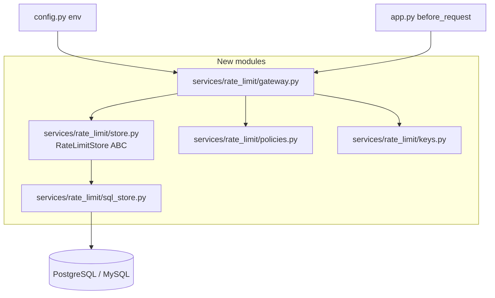
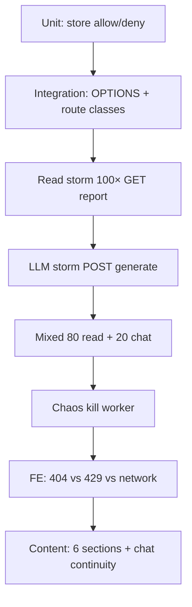

# FinPilot Implementation Plan — Rate Limiter & Platform Bottlenecks

**Status:** Action plan (ready to execute)  
**Target:** ~100 concurrent users, production-ready posture  
**Companion docs:**
- `RATE_LIMITER_ARCHITECTURE.md` — design + prerequisites  
- `PLATFORM_ARCHITECTURE_BOTTLENECKS.md` — bottleneck analysis  
- `FRONTEND_ERROR_HANDLING.md` — client error contract (partially implemented)

---

## 1. Objective

Deliver a durable, fair rate limiter **and** remove the platform bottlenecks that would otherwise break auto-load, truncate AI content, or stall workers once the limiter is fixed.

**Outcomes**

| Outcome | Success signal |
|---|---|
| Reports auto-load reliably | `GET /report/<id>` never 429 under normal UX |
| LLM spend protected | Per-key + per-user caps on generate/chat |
| Complete AI content | Reports include all 6 sections; chat not cut mid-sentence |
| Generate pipeline resilient | PDF failure does not discard AI text |
| Frontend truthful | 429 ≠ “no report”; Retry works |
| Platform holds 100 users | Load tests in §10 pass |

---

## 2. Roadmap overview

```mermaid
flowchart LR
  subgraph Wave0["Wave 0 — Unblock"]
    W0A["P0 Limiter policies"]
    W0B["AI completeness"]
    W0C["FE error polish"]
  end

  subgraph Wave1["Wave 1 — Durable limiter"]
    W1A["SQL RateLimitStore"]
    W1B["Structured 429"]
    W1C["Health + cleanup"]
  end

  subgraph Wave2["Wave 2 — Hot path"]
    W2A["Persist before PDF"]
    W2B["Sanitize PDF"]
    W2C["Chat context fix"]
    W2D["Shared report cache"]
  end

  subgraph Wave3["Wave 3 — Scale"]
    W3A["Worker sizing"]
    W3B["Async PDF / jobs"]
    W3C["App DB → PostgreSQL"]
  end

  subgraph Wave4["Wave 4 — Optional"]
    W4A["Redis limiter adapter"]
    W4B["Object storage for PDFs"]
  end

  Wave0 --> Wave1 --> Wave2 --> Wave3 --> Wave4
```

| Wave | Theme | Est. effort | Blocks production? |
|---|---|---|---|
| **0** | Stop bleeding (policies + tokens + FE) | 1–2 days | **Yes — do first** |
| **1** | SQL-backed limiter | 2–4 days | Yes for multi-worker |
| **2** | Generate/chat correctness | 2–3 days | Yes for content quality |
| **3** | Concurrency & DB | 3–7 days | Before heavy load |
| **4** | Redis / object store | As needed | No |

---

## 3. Wave 0 — Unblock (immediate)

**Goal:** Fix the regenerate loop and incomplete responses **without** waiting on PostgreSQL.

### 3.1 P0 — Rate limiter policy hotfix

| # | Task | Files | Detail |
|---|---|---|---|
| 0.1 | Exempt `OPTIONS` from limiting | `app.py`, `extensions.py` | CORS preflight must never 429 |
| 0.2 | Remove global `60/hour` from reads | `extensions.py` | Drop default hour limit or scope it to `llm_*` only |
| 0.3 | Tag route classes | `routes/*.py` | Generous limits on `GET /report`, history, users; keep tight on generate/chat |
| 0.4 | Dev-friendly defaults | `config.py` | e.g. `RATELIMIT_ENABLED`, higher read ceilings in `FLASK_ENV=development` |

**Acceptance**

- [ ] Navigating Dashboard ↔ Advisory for 15 minutes does not produce `GET /report` 429  
- [ ] `OPTIONS /api/report/<id>` returns 200/204, never 429  
- [ ] `POST /generate-report` still capped (e.g. 5/min)

**Dev fallback (if SQL not ready):** keep `memory://` only for single-process local; document that multi-worker needs Wave 1.

### 3.2 AI completeness hotfix

| # | Task | Files | Detail |
|---|---|---|---|
| 0.5 | Split `max_tokens` | `services/ai_service.py`, `config.py` | Report ≥ 3500–4096; chat ≥ 1200–1500; env-configurable |
| 0.6 | Check `finish_reason` | `ai_service.py` | Log + optional continue if `length`; surface truncation metric |
| 0.7 | Update tests | `tests/test_ai_service.py` | Assert per-call token budgets |

**Acceptance**

- [ ] New reports contain all 6 sections in ≥ 9/10 generations  
- [ ] Truncation logged when `finish_reason == length`

### 3.3 Frontend / product polish (delta on existing work)

| # | Task | Files | Detail |
|---|---|---|---|
| 0.8 | Persist `activeUserId` | `App.jsx` | `sessionStorage` so refresh reselects profile |
| 0.9 | Align backend 429 body (stub) | `app.py` errorhandler | Even on Flask-Limiter, return JSON `{ code, retry_after }` if possible |
| 0.10 | Smoke checklist | Manual | 404 empty · 429 banner · network toast |

**Note:** Structured `ApiError` + banners already landed; verify against real 429 after 0.1–0.3.

---

## 4. Wave 1 — Durable SQL rate limiter

**Goal:** Shared counters across workers; fair keys; production HTTP contract.  
**Depends on:** Prerequisites in `RATE_LIMITER_ARCHITECTURE.md` §7 (PostgreSQL/MySQL up).

### 4.1 Tasks

| # | Task | Detail |
|---|---|---|
| 1.1 | Add deps | `SQLAlchemy`, `psycopg` (or `PyMySQL`); pin in `requirements.txt` |
| 1.2 | Config | `RATELIMIT_STORAGE_BACKEND=sql\|memory`, `RATELIMIT_DATABASE_URL`, per-class quotas |
| 1.3 | Migrations / SQL scripts | `rate_limit_buckets`, optional `rate_limit_events` |
| 1.4 | Implement `SqlRateLimitStore` | Fixed-window UPSERT (see architecture doc §5) |
| 1.5 | Implement `MemoryRateLimitStore` | Local/dev + tests without DB |
| 1.6 | `PolicyRegistry` + `KeyBuilder` | Hash API key; per-`user_id` on `llm_*` |
| 1.7 | `RateLimitGateway` | Wire in `before_request`; fail-closed on `llm_*`, fail-open on `read_*` if store down |
| 1.8 | Retire/bypass Flask-Limiter defaults | Avoid double-limiting; keep package only if useful as shell |
| 1.9 | Structured 429 | JSON + `Retry-After` + optional `X-RateLimit-*` headers |
| 1.10 | `/api/health` | Exempt; report limiter DB ping |
| 1.11 | Bucket TTL job | Daily delete of stale windows |
| 1.12 | Unit + integration tests | Allow/deny, OPTIONS exempt, multi-key isolation |

### 4.2 Suggested quotas (ship defaults)

| Route class | Limit |
|---|---|
| `cors_preflight` | Exempt |
| `read_light` | 300 / min / key |
| `read_report` / `read_chat` | 120 / min / key |
| `write_profile` | 30 / min / key |
| `write_goal` | 20 / min / key |
| `llm_chat` | 15 / min / key **and** 60 / hour / user |
| `llm_report` | 5 / min / key **and** 10 / hour / user |

### 4.3 Acceptance

- [ ] Two API workers share the same counters  
- [ ] Killing a worker does not reset limits  
- [ ] Read storm (100 concurrent GET report) → ~0 read 429  
- [ ] LLM storm → clean 429 with `code=rate_limit_exceeded`  
- [ ] Frontend warning banner + Retry works against real JSON 429  

---

## 5. Wave 2 — Hot-path correctness (post-limiter bottlenecks)

**Goal:** Fix issues the limiter does **not** solve — content, PDF, chat context, fetch amplification.

### 5.1 Report pipeline

| # | Task | Files | Detail |
|---|---|---|---|
| 2.1 | Persist AI + health **before** PDF | `routes/report_routes.py` | PDF failure must not drop advisory text |
| 2.2 | Soft-fail PDF | Same | Return 200 with report; flag `pdf_ready: false` or regen on download |
| 2.3 | Sanitize markdown for ReportLab | `services/pdf_service.py` | Escape/` ` rules; strip pipe tables that break parser |
| 2.4 | Download regenerates PDF if blob missing | `download_report` | No forced full AI regen |

### 5.2 Chat quality

| # | Task | Files | Detail |
|---|---|---|---|
| 2.5 | Fix history key mismatch | `services/ai_service.py` | Use `message` (or normalize to `content`) |
| 2.6 | Widen context window | Same | Last N messages with token budget awareness |
| 2.7 | Distinguish upstream errors | `ai_service` + routes | Map Groq 429/5xx → `upstream_rate_limit` / `upstream_error` |

### 5.3 Frontend amplification

| # | Task | Files | Detail |
|---|---|---|---|
| 2.8 | Shared report store | New context or lift state in `App.jsx` | One fetch for Dashboard + Advisory |
| 2.9 | Deduplicate Strict Mode noise | Hooks | Guard or shared promise cache for in-flight GET |

### 5.4 Acceptance

- [ ] PDF parse error still leaves report loadable via GET  
- [ ] Multi-turn chat uses prior user/AI text  
- [ ] Opening Dashboard then Advisory causes **one** report GET (or cached)  

---

## 6. Wave 3 — Scale for 100 concurrent users

**Goal:** Prevent worker exhaustion and SQLite write contention under allowed LLM traffic.

### 6.1 Process & workers

| # | Task | Detail |
|---|---|---|
| 3.1 | Document worker formula | `workers ≈ peak_concurrent_llm + headroom` (e.g. 4–8 for early prod) |
| 3.2 | Timeouts | Proxy/gunicorn timeout > worst Groq latency; return structured timeout error |
| 3.3 | Optional report job queue | Celery/RQ/ARQ: `POST` enqueues; client polls `GET /report` or job status |

### 6.2 Application database

| # | Task | Detail |
|---|---|---|
| 3.4 | Busy timeout / short transactions | Immediate SQLite hardening |
| 3.5 | Migrate app data SQLite → PostgreSQL | When report/chat write contention appears |
| 3.6 | Connection pooling | SQLAlchemy pool for app DB |

### 6.3 Acceptance

- [ ] Mixed load (80 readers + 20 chatters) keeps p95 read &lt; 200 ms  
- [ ] No worker deadlocks under LLM cap  
- [ ] Chaos: kill worker mid-generate → other workers healthy; limiter intact  

---

## 7. Wave 4 — Optional hardening

| # | Task | When |
|---|---|---|
| 4.1 | `RedisRateLimitStore` | Multi-region or limiter QPS ≫ SQL comfort |
| 4.2 | PDF object storage (S3/disk) | DB size / backup pain from BLOBs |
| 4.3 | Streaming chat | UX priority |
| 4.4 | Per-tenant API keys | Multi-customer SaaS |

---

## 8. Work breakdown by codebase area

| Area | Wave 0 | Wave 1 | Wave 2 | Wave 3 |
|---|---|---|---|---|
| `extensions.py` / `app.py` | Policy hotfix, OPTIONS | Gateway wiring | — | Timeouts |
| `config.py` | Token + limit envs | SQL URL / backend | — | Pool settings |
| `services/ai_service.py` | max_tokens, finish_reason | — | History key, upstream codes | — |
| `routes/report_routes.py` | Read limits | Class tags | Persist-before-PDF | Async hook |
| `services/pdf_service.py` | — | — | Sanitize | — |
| `services/rate_limit/*` | — | **New package** | — | — |
| Frontend hooks/pages | Session user, verify 429 | Consume JSON 429 | Shared report cache | — |
| `tests/` | Token asserts | Limiter unit/integration | Report save-without-PDF | Load scripts |
| `docs/` | Update “as-built” notes | Runbook | — | Capacity runbook |

---

## 9. Suggested sprint schedule

| Day | Focus | Exit |
|---|---|---|
| **1** | Wave 0.1–0.4 (limiter policy) | Auto-load works locally |
| **1–2** | Wave 0.5–0.7 (tokens) | Full 6-section reports |
| **2** | Wave 0.8–0.10 + FE verify | No false empty states |
| **3–5** | Wave 1 (SQL limiter) | Staging multi-worker limits |
| **5–7** | Wave 2 (PDF + chat + cache) | Generate resilient; chat contextual |
| **8–12** | Wave 3 (workers + DB) | Load tests green |
| **Later** | Wave 4 | As metrics demand |

---

## 10. Test & verification plan

| Test | Pass criteria |
|---|---|
| Read storm | ~0 `read_*` 429 over 2 minutes |
| LLM storm | 429 with JSON `code` + `Retry-After`; no hang |
| Mixed | Reads healthy; chat/report fair per user |
| Chaos | Counters durable (SQL); app recovers |
| Content | Sections complete; history used in prompt |
| FE | Warning on 429; EmptyState only on 404 |

Automate with a small script (e.g. `scripts/load_test_rate_limit.py`) using concurrent `httpx`/`asyncio`.

---

## 11. Risks & mitigations

| Risk | Impact | Mitigation |
|---|---|---|
| Ship SQL limiter before P0 policy fix | Still broken UX | **Wave 0 first** |
| Fail-closed on reads if limiter DB down | False outage | Fail-open + alert for `read_*` |
| Raise tokens → higher Groq cost | Spend spike | Keep per-user hour caps; monitor |
| Async reports increase complexity | Schedule slip | Persist-before-PDF first; queue later |
| SQLite migration mid-feature | Data risk | Backup + dual-write or maintenance window |

---

## 12. Definition of Done (production gate)

All must be true:

1. Wave 0 and Wave 1 complete and verified in staging.  
2. Wave 2.1–2.5 complete (persist-before-PDF + chat context + sanitize).  
3. Frontend treats 429 / 404 / network correctly (manual + automated smoke).  
4. Load tests §10 pass at target concurrency.  
5. Runbook exists: reset bucket, raise quota, limiter DB failover behavior.  
6. `docs/` updated with **as-built** notes (deviations from architecture called out).

Wave 3 (PostgreSQL app DB / async jobs) may be **conditionally** deferred if staging load tests pass on hardened SQLite **and** LLM concurrency is strictly capped — document the residual risk.

---

## 13. Immediate next actions (start here)

1. Implement **Wave 0.1–0.4** (OPTIONS exempt + read vs LLM policies).  
2. Implement **Wave 0.5–0.7** (`max_tokens` + `finish_reason`).  
3. Provision PostgreSQL (or MySQL) for limiter → begin **Wave 1**.  
4. Track progress with the checklists in §§3–6 of this document.

---

*Owner: FinPilot platform. This plan supersedes informal ordering in the bottleneck doc and expands the phase table in the rate-limiter architecture doc into an executable backlog.*
