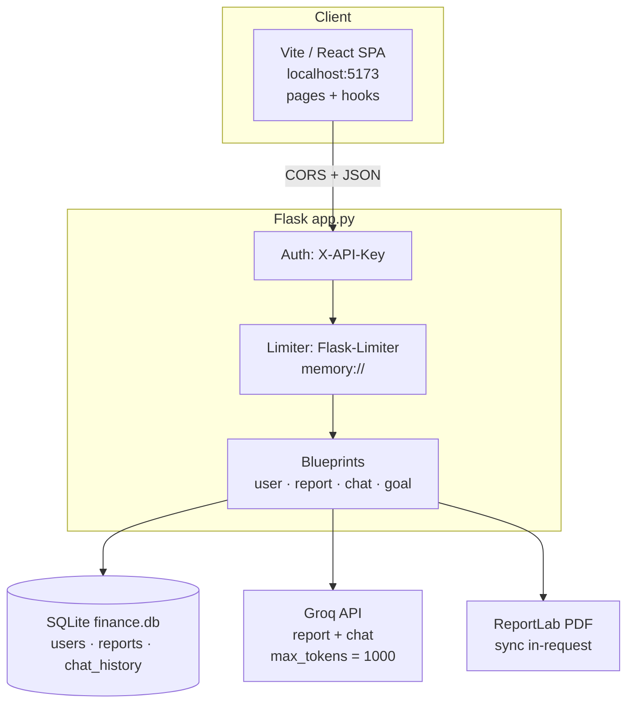
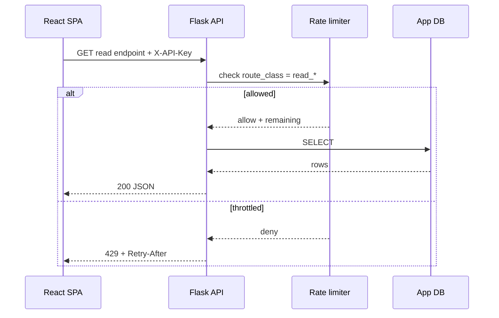
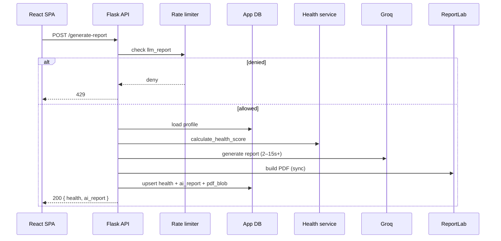
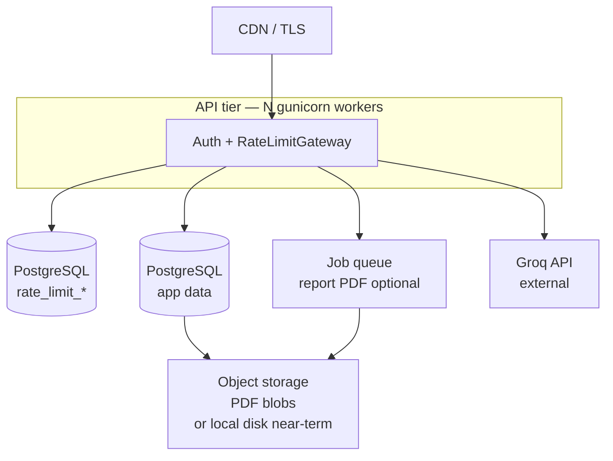

# FinPilot Platform Architecture & Rate-Limiter Bottleneck Analysis

**Status:** Architecture assessment for ~100 concurrent users  
**Companion docs:** `RATE_LIMITER_ARCHITECTURE.md`, `FRONTEND_ERROR_HANDLING.md`  
**Scope:** Whether other platform components become a bottleneck **before**, **beside**, or **because of** the rate limiter  

---

## 1. Current platform topology

| Layer | Technology today | Role |
|---|---|---|
| UI | React 19 + Vite | Profile, Dashboard, Advisory, Chat, Goals |
| API | Flask + Marshmallow + Flasgger | Sync request/response |
| Auth | Shared `API_SECRET_KEY` header | No per-user auth yet |
| Limits | Flask-Limiter + `memory://` | Broken for reads (see limiter doc) |
| App DB | SQLite WAL (`finance.db`) | Profiles, reports (incl. PDF blob), chat |
| AI | Groq chat completions | Report + chat (non-streaming) |
| PDF | ReportLab | Blocks request until done |

---

## 2. Request critical paths

### 2.1 Cheap path (must stay under limiter “read” budget)

`GET /users` · `GET /report/<id>` · `GET /chat/history/<id>` · `GET /download-report/<id>`

- Cost: SQLite read + JSON  
- Latency target: &lt; 50–100 ms  
- **Limiter must not be the failure mode** (today it is)

### 2.2 Expensive path (limiter should gate)

`POST /generate-report`

`POST /chat` — Groq chat model + history read/write  
`POST /goal-plan` — CPU math only (lighter)

---

## 3. Bottleneck matrix vs rate limiter

Legend: **L** = limiter can hide this bug · **B** = this becomes the bottleneck once limiter is fixed · **C** = coupled (limiter + component interact)

| Component | Risk at 100 concurrent | Relation to limiter | Severity |
|---|---|---|---|
| Flask-Limiter `60/hour` on reads | Auto-load fails now | **L** (current) | Critical |
| `memory://` store | Per-worker drift; resets | **L** | High |
| IP-based keys | Shared NAT → unfair throttle | **L** | High |
| SQLite single-writer | Write lock under report/chat/profile concurrency | **B** after reads work | High |
| Sync Groq in request thread | Workers blocked 2–15s each | **B** / **C** | Critical |
| ReportLab in request | Extra CPU after LLM; PDF fail discards AI text | **B** | High |
| Groq provider quotas | 429/5xx from upstream | **C** (app limiter ≠ provider) | High |
| `max_tokens=1000` | Incomplete reports/chats (quality) | Independent of limiter | High |
| Chat `message` vs `content` | Broken multi-turn context | Independent | Medium |
| Dual `useReport` fetches | Extra read QPS → burns limiter | **C** | Medium |
| No connection pool / queue | Thread exhaustion under LLM | **B** | High |
| Shared single API key | All tenants share one LLM budget | **C** | Medium (early prod) |
| PDF BLOB in SQLite | Large writes, DB growth | **B** | Medium |
| CORS `*` + OPTIONS limited | Preflight 429 | **L** | Critical |

---

## 4. Deep dive: components that will bottleneck *after* limiter fix

### 4.1 SQLite as application database

**Why it becomes the bottleneck**

- One writer at a time; WAL helps readers but report upserts + chat inserts contend.  
- PDF blobs inflate DB size and write latency.  
- `check_same_thread=False` + new connection per call is OK for low load, not ideal for 100 concurrent writes.

**Limiter interaction**

- A correct limiter reduces LLM stampede but **does not** serialize SQLite writes across allowed requests.  
- If 20 reports/minute are allowed, SQLite + PDF may still queue or time out.

**Recommendation (production path)**

| Horizon | Action |
|---|---|
| Near-term (100 users) | Keep SQLite **only if** report generation is strictly rate-limited and PDF stored carefully; enable busy timeout; avoid long transactions |
| Better | Move app data to **PostgreSQL** (same instance or separate from limiter DB) |
| PDF | Store object storage (S3/local disk) + path in DB; or async PDF job |

### 4.2 Synchronous Groq calls (primary throughput bottleneck)

**Why**

- Each report/chat holds a WSGI worker until Groq returns.  
- 4 workers × 5s average = ~0.8 LLM req/s sustained before queueing.  
- 100 users sending chat in a burst → most wait on the server queue **before** hitting Groq — limiter may still allow them into the app.

**Limiter interaction**

- Limiter protects **provider spend** and fairness.  
- It does **not** create spare worker capacity.  
- If limits are too loose relative to worker count, users see **hangs/timeouts** (504/proxy) instead of clean 429.

**Recommendation**

| Pattern | Fit |
|---|---|
| Size workers to `llm_*` max concurrency | e.g. `workers ≈ peak_concurrent_llm + headroom` |
| Return 429 early (limiter) **before** acquiring a worker-heavy path | Already the goal of gateway |
| Later: async job queue for reports (Celery/RQ/ARQ) | Client polls `GET /report` |
| Streaming chat (optional) | Better UX; still needs worker/async strategy |

### 4.3 ReportLab PDF in the hot path

**Why**

- CPU-bound; fragile HTML/markdown → parse errors (already seen: ` ` in tables → 500).  
- Today: PDF failure → **no DB save** of AI text → user regenerates (wastes Groq + limiter budget).

**Limiter interaction**

- Failed generates still consume LLM quota if counted before PDF; or force retries that re-hit `llm_report` limits.

**Recommendation**

1. Persist `health` + `ai_report` **before** PDF.  
2. Generate PDF async or best-effort; download endpoint regenerates if blob missing.  
3. Sanitize markdown for ReportLab.

### 4.4 Groq upstream limits & errors

**Why**

- Provider TPM/RPM and model availability are independent of FinPilot’s limiter.  
- Incomplete answers from `max_tokens=1000` look like “bugs” but are generation caps.

**Limiter interaction**

- App 429 vs Groq 429 must be distinguishable in API error `code` (`rate_limit_exceeded` vs `upstream_rate_limit`).  
- Frontend must show different copy (see error-handling doc).

### 4.5 Frontend fetch amplification

**Why**

- Dashboard + Advisory each mount `useReport` → duplicate GETs.  
- React Strict Mode doubles effects in dev.  
- No shared cache / React Query.

**Limiter interaction**

- Multiplies read QPS; with broken shared hour budget, this **caused** the outage.  
- With fixed `read_report` policy, still wasteful.

**Recommendation**

- Single report context/query cache.  
- Persist `activeUserId` in `sessionStorage` to avoid remount storms after refresh.

### 4.6 Auth model (shared API key)

**Why**

- One browser key = one limiter identity for all end users unless keyed by `user_id` on writes.

**Limiter interaction**

- Per-key limits alone are insufficient; **per-user_id** ceilings on `llm_*` are required for fairness among 100 humans sharing one SPA key.

---

## 5. Will the *rate limiter itself* become a bottleneck?

With SQL fixed-window UPSERT on PostgreSQL/MySQL for 100 users:

| Concern | Assessment |
|---|---|
| Limiter DB QPS | Low (tens–low hundreds/s peak) — **not** a bottleneck |
| Lock contention | Primary key UPSERT is fine at this scale |
| Extra latency | +1–3 ms per request if pool is local/same AZ — acceptable |
| Failure mode | If limiter DB is down: **fail open** (allow + alert) vs **fail closed** (503). Recommend **fail closed for `llm_*`**, **fail open for `read_*`** with metric |

**Conclusion:** At 100 concurrent users, a SQL limiter is **not** the bottleneck. **LLM concurrency, SQLite writes, and sync PDF** are.

---

## 6. Target production architecture (limiter-friendly)

**Ordering of investments (so limiter works end-to-end):**

1. Fix limiter policies + SQL store + OPTIONS exempt (P0/P1).  
2. Frontend status-aware errors (no false “missing report”).  
3. Raise `max_tokens` / finish_reason handling (content completeness).  
4. Persist report text before PDF; sanitize PDF.  
5. Size workers to LLM concurrency; consider async reports.  
6. Migrate app DB SQLite → PostgreSQL when write contention appears.  
7. Redis limiter adapter only if multi-region / higher QPS demands it.

---

## 7. Capacity sketch (100 concurrent users)

| Metric | Estimate |
|---|---|
| Active browsers | 100 |
| Steady read QPS | 5–20 |
| Burst read QPS (page open) | 50–150 for a few seconds |
| Steady LLM QPS | 0.2–2 (policy-capped) |
| Peak LLM in-flight | ≈ number of workers (sync model) |
| App DB | SQLite OK for light writes; PG recommended before heavy report churn |
| Limiter DB | Small PG/MySQL schema; shared or dedicated |

---

## 8. Bottleneck test plan (before calling prod “ready”)

1. **Read storm:** 100 concurrent clients hammer `GET /report/{id}` for 2 minutes → expect ~0 read 429.  
2. **LLM storm:** 100 clients try `POST /generate-report` → expect clean 429 with `Retry-After`, no worker deadlock.  
3. **Mixed:** 80 readers + 20 chatters → reads stay healthy; chat limited per user.  
4. **Chaos:** Kill one API worker mid-flight → limiter counters intact (SQL).  
5. **Upstream:** Simulate Groq timeout → API returns 502/504 with `upstream_*` code, not generic 500 toast as “no report”.

---

## 9. Summary verdict

| Question | Answer |
|---|---|
| Is the rate limiter the current user-visible bug for “reports won’t load”? | **Yes** (60/hour + OPTIONS + misclassified errors) |
| After fixing the limiter, is the platform safe for 100 concurrent users? | **Partially** — LLM worker blocking + SQLite/PDF remain real risks |
| Will SQL rate limiting bottleneck the platform? | **No** at this scale |
| What must not be ignored while implementing the limiter? | Worker sizing, per-user LLM caps, report persist-before-PDF, frontend 429 handling, Groq token limits |

---

*See `RATE_LIMITER_ARCHITECTURE.md` for prerequisites and SQL design. See `FRONTEND_ERROR_HANDLING.md` for client-side contracts.*
