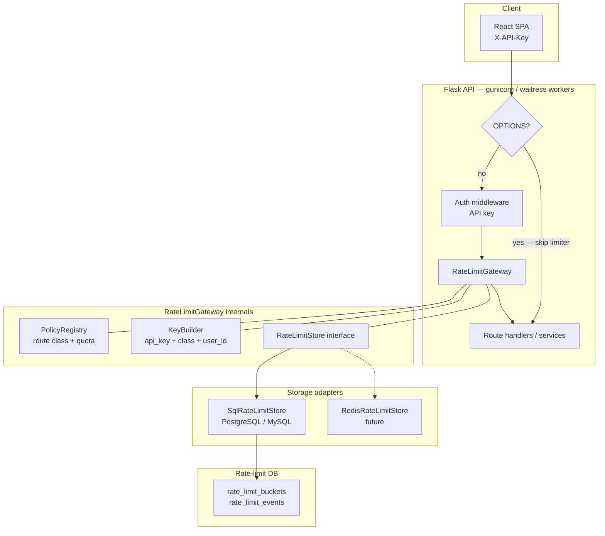
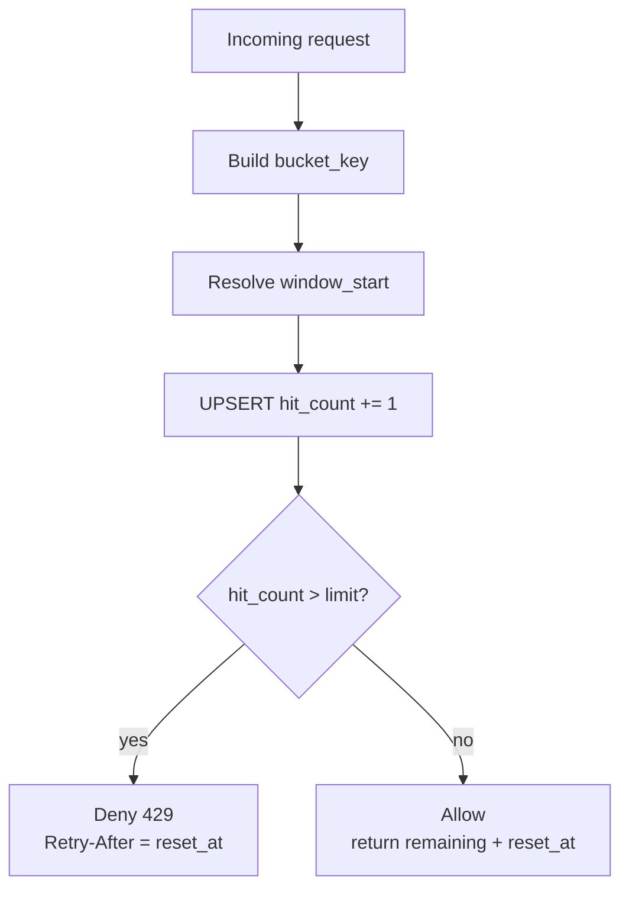

# FinPilot Rate Limiter Architecture

**Status:** Design specification (implementation pending)  
**Target capacity:** 100 concurrent users  
**Storage (near-term):** PostgreSQL **or** MySQL (not Redis)  
**Future swap:** Redis-compatible adapter without changing route decorations  

---

## 1. Goals

| Goal | Requirement |
|---|---|
| Protect expensive LLM routes | Tight limits on `POST /generate-report`, `POST /chat`, `POST /goal-plan` |
| Never block cheap reads | Generous / separate budgets for `GET` report, chat history, users, PDF |
| Never break CORS | `OPTIONS` must be **fully exempt** from limiting |
| Survive multi-worker deploy | Shared durable store (SQL), not process-local `memory://` |
| Support 100 concurrent users | Per-API-key / per-user keys; capacity-planned tables & indexes |
| Stay future-proof | Storage behind an interface; Redis can replace SQL later |

---

## 2. Why the current limiter fails

Today (`extensions.py` + Flask-Limiter defaults):

| Problem | Impact |
|---|---|
| `default_limits = ["200/day", "60/hour"]` on **all** routes | `GET /report/<id>` burns the same budget as LLM writes |
| Key = client IP only | All users behind one NAT / office share one bucket |
| Storage = `memory://` | Limits reset per process; not shared across workers; lost on restart |
| CORS `OPTIONS` counted | Preflight 429 → browser never sends the real GET → UI shows “no report” |
| Frontend maps any non-OK → “no report” | 429 looks like missing data → regenerate loop |

**Verified in production logs:** `OPTIONS /api/report/10 → 429` while the row exists in SQLite.

---

## 3. Target architecture (future-proof)



### 3.1 Components

| Component | Responsibility |
|---|---|
| **PolicyRegistry** | Maps each endpoint to a **route class** and quota (window + max hits) |
| **KeyBuilder** | Builds storage keys: `{api_key_hash}:{route_class}` (optional `:{user_id}` for write routes) |
| **RateLimitStore** | Abstract: `incr_and_check(key, window_seconds, limit) → {allowed, remaining, reset_at}` |
| **SqlRateLimitStore** | PostgreSQL/MySQL implementation (near-term) |
| **RedisRateLimitStore** | Drop-in later; same interface |
| **RateLimitGateway** | Flask before-request / decorator; emits `429` + `Retry-After` + JSON body |

Flask-Limiter may wrap this gateway **or** be replaced by the gateway. Prefer a thin custom gateway so SQL storage and policy classes are first-class (Flask-Limiter’s built-in stores are memory / Redis / Memcached / Mongo — **not** first-class PG/MySQL).

---

## 4. Route classes & recommended quotas (100 concurrent users)

Assume ~100 concurrent sessions, shared API key in early prod (or N tenant keys later).

| Route class | Endpoints | Suggested limit | Notes |
|---|---|---|---|
| `cors_preflight` | All `OPTIONS` | **Exempt** | Mandatory |
| `read_light` | `GET /users`, `GET /profile/*` | 300 / min / key | Profile lists |
| `read_report` | `GET /report/<id>`, `GET /download-report/<id>` | 120 / min / key | Auto-load must never 429 under normal UX |
| `read_chat` | `GET /chat/history/<id>` | 120 / min / key | |
| `write_profile` | `POST /profile`, `DELETE /profile/<id>` | 30 / min / key | |
| `write_goal` | `POST /goal-plan` | 20 / min / key | CPU + math, cheap vs LLM |
| `llm_chat` | `POST /chat` | 15 / min / key **and** 60 / hour / user_id | Protects Groq spend |
| `llm_report` | `POST /generate-report` | 5 / min / key **and** 10 / hour / user_id | Most expensive |

**Remove** the global `60/hour` default on read routes. Global daily ceiling (optional) can stay as a safety net on `llm_*` only.

### 4.1 Concurrent-user math (sanity)

Worst-case auto-load storm: 100 users open Dashboard + Advisory within 10s.

- Each user: ~2–4 `GET /report` (Strict Mode / dual hooks) → up to ~400 GETs  
- At `120/min` per key: **allowed** if one shared key  
- At old `60/hour`: **exhausted immediately** ← current failure mode  

LLM: 100 users each generating one report in a minute would need `llm_report` ≥ 100/min if uncapped — **do not**. Cap per user_id (10/hour) so one abusive client cannot exhaust Groq for everyone.

---

## 5. SQL storage design (PostgreSQL preferred; MySQL OK)

### 5.1 Algorithm: fixed-window counter (simple, production-adequate)



For each `(bucket_key, window_start)`:

1. `UPSERT` increment `hit_count`
2. If `hit_count > limit` → deny
3. Else allow; return `remaining` and `reset_at = window_start + window`

Sliding window / token bucket can replace later without changing PolicyRegistry.

### 5.2 Schema (PostgreSQL)

```sql
CREATE TABLE rate_limit_buckets (
    bucket_key     TEXT        NOT NULL,
    window_start   TIMESTAMPTZ NOT NULL,
    window_seconds INTEGER     NOT NULL,
    hit_count      INTEGER     NOT NULL DEFAULT 0,
    updated_at     TIMESTAMPTZ NOT NULL DEFAULT NOW(),
    PRIMARY KEY (bucket_key, window_start)
);

CREATE INDEX idx_rl_buckets_updated
    ON rate_limit_buckets (updated_at);

-- Optional audit (sampled) for abuse investigation
CREATE TABLE rate_limit_events (
    id             BIGSERIAL PRIMARY KEY,
    bucket_key     TEXT        NOT NULL,
    route_class    TEXT        NOT NULL,
    allowed        BOOLEAN     NOT NULL,
    created_at     TIMESTAMPTZ NOT NULL DEFAULT NOW()
);
```

MySQL equivalent: `DATETIME(6)`, `BIGINT AUTO_INCREMENT`, `utf8mb4`, composite PK same idea.

### 5.3 Atomic increment (PostgreSQL)

```sql
INSERT INTO rate_limit_buckets (bucket_key, window_start, window_seconds, hit_count)
VALUES ($1, $2, $3, 1)
ON CONFLICT (bucket_key, window_start)
DO UPDATE SET
  hit_count  = rate_limit_buckets.hit_count + 1,
  updated_at = NOW()
RETURNING hit_count;
```

MySQL 8+: `INSERT … ON DUPLICATE KEY UPDATE hit_count = hit_count + 1`.

### 5.4 Maintenance

- Cron / background job: `DELETE FROM rate_limit_buckets WHERE updated_at < NOW() - INTERVAL '2 days'`
- Connection pool dedicated to limiter (see §7) so limiter writes never starve app queries

---

## 6. HTTP contract (stable for frontend)

### 6.1 Success headers (optional but recommended)

```
X-RateLimit-Limit: 120
X-RateLimit-Remaining: 87
X-RateLimit-Reset: 1710000060
```

### 6.2 429 body (JSON)

```json
{
  "error": "Rate limit exceeded",
  "code": "rate_limit_exceeded",
  "route_class": "llm_report",
  "retry_after": 42,
  "limit": 5,
  "window_seconds": 60
}
```

Plus header: `Retry-After: 42`.

Frontend must treat `code === "rate_limit_exceeded"` / status `429` as **retryable throttle**, never as “resource missing”.

---

## 7. Prerequisites (must be ready before implementation)

### 7.1 Infrastructure

| Prerequisite | Detail |
|---|---|
| **PostgreSQL 14+** (preferred) **or MySQL 8+** | Dedicated database or schema `finpilot_ratelimit` |
| Network reachability | App servers → DB host:port; firewall allowlist |
| Credentials | Least-privilege DB user: `SELECT/INSERT/UPDATE/DELETE` on limiter tables only |
| TLS | Require SSL/TLS to DB in staging/prod |
| Connection pool | e.g. PgBouncer or SQLAlchemy pool `pool_size=5–10`, `max_overflow=10` for limiter only |
| Time sync | NTP on app + DB hosts (window boundaries depend on clock) |

### 7.2 Application / config

| Prerequisite | Detail |
|---|---|
| Env vars | `RATELIMIT_STORAGE_BACKEND=sql` · `RATELIMIT_DATABASE_URL=postgresql+psycopg://…` (or `mysql+pymysql://…`) |
| Keep `RATELIMIT_STORAGE_URI` | Alias / fallback; document migration off `memory://` |
| Stable client identity | Production API keys (per tenant/user) — do **not** rely on IP alone |
| CORS config | Explicit origins in prod; OPTIONS must bypass limiter |
| Migrations | Alembic (or SQL scripts) for `rate_limit_*` tables |
| Health check | `/api/health` exempt from limits; includes “limiter DB reachable” |

### 7.3 Python packages (planned)

| Package | Purpose |
|---|---|
| `SQLAlchemy` ≥ 2.x | Engine + pooled connections |
| `psycopg` (v3) **or** `PyMySQL` | DB driver |
| Keep `flask-limiter` optional | Only if used as decorator shell; SQL store is custom |

### 7.4 Capacity sizing for 100 concurrent users

| Resource | Guidance |
|---|---|
| Limiter QPS | Peak ~50–150 incr/s during page storms; fixed-window UPSERT is fine on a small PG instance |
| DB instance | 1 vCPU / 1 GB RAM is enough for limiter-only at this scale |
| Disk | Negligible if TTL cleanup runs daily |
| App workers | 2–4 sync workers OK for 100 users **if** LLM calls don’t block all workers (see platform bottleneck doc) |

### 7.5 Operational prerequisites

| Prerequisite | Detail |
|---|---|
| Metrics | Counters: `rate_limit_allowed`, `rate_limit_denied` by `route_class` |
| Alerts | Spike in 429 on `read_*` (should be near-zero); sustained 429 on `llm_*` OK under abuse |
| Runbook | How to reset a bucket key; how to raise limits via config without deploy if possible |
| Load test | Script: 100 concurrent `GET /report` + sparse `POST /chat` before go-live |
| Staging parity | Same SQL backend as prod (not `memory://`) |

### 7.6 Security prerequisites

| Prerequisite | Detail |
|---|---|
| Hash API keys in bucket keys | Store `sha256(api_key)[:16]`, never raw secrets in `bucket_key` |
| No PII in keys | Prefer opaque user ids |
| Separate secrets | Limiter DB password ≠ app DB password |

### 7.7 Explicit non-prerequisites (deferred)

| Deferred | Reason |
|---|---|
| Redis | Not required for P1; interface reserved for later |
| Multi-region limiter | Single-region SQL is enough for 100 users |
| Per-IP bans / WAF | Edge concern; optional later |

---

## 8. Implementation phases (when coding starts)

| Phase | Work | Done when |
|---|---|---|
| **P0** | Exempt OPTIONS; split read vs LLM policies; stop using global 60/hour on reads | Auto-load works under normal browsing |
| **P1** | `RateLimitStore` + `SqlRateLimitStore` + env wiring + migrations | Limits shared across workers via PG/MySQL |
| **P1b** | Structured 429 JSON + `Retry-After` | Frontend can show accurate messages |
| **P2** | Metrics, cleanup job, config-driven quotas | Operable in prod |
| **P3** | `RedisRateLimitStore` adapter | Hot-path swap without route rewrites |

---

## 9. Acceptance criteria (100 concurrent users)

1. 100 users can open Dashboard/Advisory repeatedly for 10 minutes **without** `read_report` 429.
2. A single user cannot call `generate-report` more than policy allows; others still succeed within their quotas.
3. Killing one app worker does **not** reset counters (SQL durability).
4. `OPTIONS` never returns 429.
5. Swapping storage backend requires config change only (no route edits).

---

## 10. References (current codebase)

| File | Role today |
|---|---|
| `extensions.py` | Global Limiter + `memory://` defaults |
| `config.py` | `RATELIMIT_STORAGE_URI` |
| `app.py` | `limiter.init_app`, OPTIONS skips **auth** only (not limiter) |
| `routes/report_routes.py` | `5/min` on generate; GET uses default hour limit |
| `routes/chat_routes.py` | `15/min` on chat |
| `routes/goal_routes.py` | `20/min` on goal-plan |

---

*Document owner: FinPilot platform. Next: implement P0/P1 after platform bottleneck review.*
